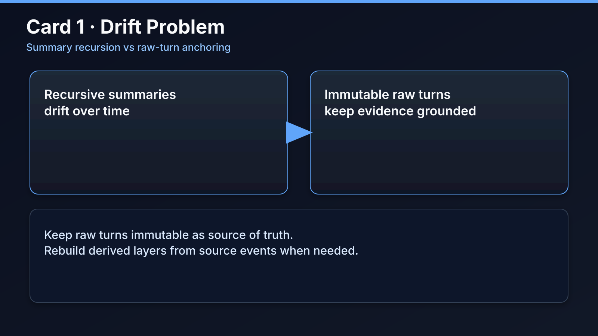
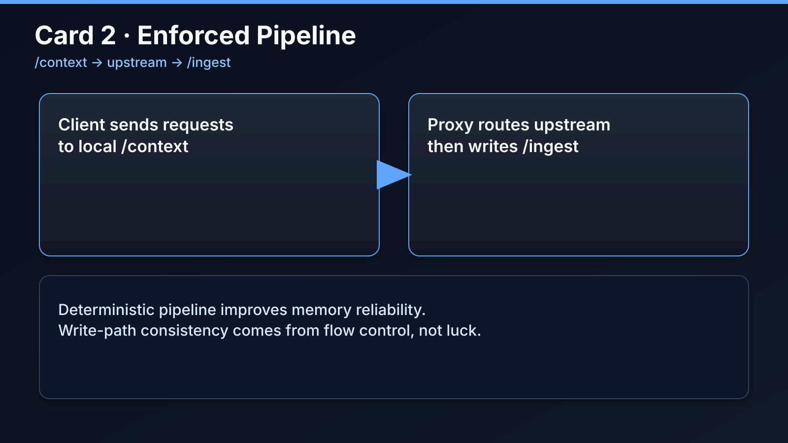
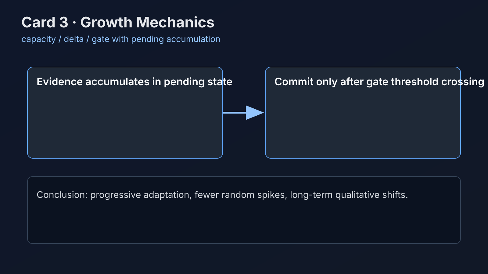
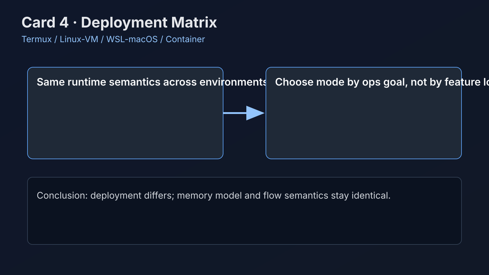

# loam — 不是“写人设”，不是“滚雪球”记忆，而是“让角色从记忆长出自我”，不断生长。

A memory runtime where identity continuity comes from raw dialogue, growth dynamics, and auditable reconstruction.
一个记忆运行时：身份连续性来自原始对话、生长动力学与可审计重建，而不是提示词拼装的人设脚本。

---

## What loam does

loam stores every conversational turn as immutable raw material, then digests that material into narrative memory, trait structure, and retrieval context. The runtime is designed for long-horizon character continuity: you can trace why a trait changed, inspect which evidence supported that shift, and rebuild derived layers when your model, policy, or prompts evolve. This design avoids recursive summary drift and gives you a stable identity substrate for months of interaction.

loam 会把每轮对话保存为不可变原料，再将其消化为叙事记忆、特质结构和检索上下文。它面向长期身份连续性：你可以追踪某个特质为何变化、查看其证据来源，并在模型、规则或提示词变化后重建派生层。这种设计避免“总结套总结”的递归漂移，为数月级交互提供稳定的身份底座。

---

## Why it is different

loam uses a no-snowball invariant: meaningful updates must anchor to raw turns, not to old persona summaries. Trait updates follow gated growth dynamics, where evidence accumulates first and commits later, so change is progressive rather than jittery. The runtime also separates chat-response model from growth/digest model, so you can tune latency and cognition independently instead of binding everything to one vendor and one model profile.

loam 采用“非滚雪球不变量”：关键更新必须锚定原始轮次，而不是旧人格总结。特质更新采用门控生长机制，证据先累积后提交，因此变化是渐进的，不会抖动跳变。同时它把聊天回复模型与生长/消化模型解耦，你可以分别优化延迟与认知质量，而不是被单一厂商和单一模型参数绑死。

---

## Growth formula and design logic

The growth system is driven by three linked terms: `capacity = max(strength, seed_floor) * max(ceiling - strength, seed_floor)`, `delta = plasticity * capacity * signal * salience`, and `gate = max(gate_floor, gate_ratio * capacity)`. In plain words, a trait does not jump immediately after one event; evidence is first accumulated in pending state and only committed after crossing the gate threshold. This is how loam keeps growth progressive, reduces random spikes, and still allows long-term qualitative shifts.

生长系统由三项联动公式驱动：`capacity = max(strength, seed_floor) * max(ceiling - strength, seed_floor)`、`delta = plasticity * capacity * signal * salience`、`gate = max(gate_floor, gate_ratio * capacity)`。直白来说，特质不会因为一次事件立刻大跳，而是先在 pending 中累积证据，跨过门槛再提交变化。这就是 loam 能同时做到“渐进变化、抑制乱跳、长期可质变”的原因。

The design thought process is: preserve immutable raw turns as ground truth, let derived layers remain rebuildable, then use gated dynamics to convert repeated evidence into stable identity structure. This is not a one-shot personality injection; it is a controlled emergence process with audit trails.

设计思路是：先把不可变原始轮次作为真值底座，再让派生层保持可重建，最后用门控动力学把重复证据转化为稳定身份结构。这不是“一次性注入人设”，而是带审计轨迹的可控涌现过程。

---

## Deployment modes (not only Termux)

loam is not limited to Termux. You can run it in four mainstream ways: **Termux on Android** for personal always-on usage; **Linux server or VM** for stable long-running instances; **WSL/macOS local dev** for desktop development and debugging; and **containerized deployment** for reproducible team environments. All modes share the same core flow (`/context -> upstream -> /ingest`) and the same upstream mapping strategy. Detailed commands are in `DEPLOYMENT_MODES.md`.

loam 并不只支持 Termux。你可以用四种主流方式部署：**Android Termux**（个人常驻）、**Linux 服务器/虚拟机**（长期稳定运行）、**WSL/macOS 本地开发**（桌面调试）、**容器化部署**（团队可复现环境）。这些模式都共享同一套核心流程（`/context -> upstream -> /ingest`）和上游映射策略。详细命令见 `DEPLOYMENT_MODES.md`。

### Start by your situation (click to jump)

- If this is your first time and you want one complete path from install to launch, start here: [FINAL_RELEASE.md](FINAL_RELEASE.md)
- If you deploy on Android/Termux, jump here: [TERMUX_QUICKSTART.md](TERMUX_QUICKSTART.md)
- If you deploy on Linux server / VM / WSL / macOS, compare and choose here: [DEPLOYMENT_MODES.md](DEPLOYMENT_MODES.md)
- If you need multi-provider routing and `provider/model` naming rules, use: [MULTI_UPSTREAM_QUICKSTART.md](MULTI_UPSTREAM_QUICKSTART.md)
- If you connect MCP / plugins / script bridge, use: [THIRD_PARTY_INTEGRATION.md](THIRD_PARTY_INTEGRATION.md)
- If you are about to publish, run this final check: [INTEGRATION_CHECKLIST.md](INTEGRATION_CHECKLIST.md)

### 按你的场景直接跳转（可点击）

- 如果你是第一次部署，想要一条从安装到启动的完整路径：点这里 [FINAL_RELEASE.md](FINAL_RELEASE.md)
- 如果你在 Android / Termux 部署：点这里 [TERMUX_QUICKSTART.md](TERMUX_QUICKSTART.md)
- 如果你在 Linux 服务器 / VM / WSL / macOS 部署：先看这里 [DEPLOYMENT_MODES.md](DEPLOYMENT_MODES.md)
- 如果你需要多上游路由和 `provider/model` 命名规则：点这里 [MULTI_UPSTREAM_QUICKSTART.md](MULTI_UPSTREAM_QUICKSTART.md)
- 如果你要接 MCP / 插件 / 脚本桥：点这里 [THIRD_PARTY_INTEGRATION.md](THIRD_PARTY_INTEGRATION.md)
- 如果你准备发布上线，先做最终检查：点这里 [INTEGRATION_CHECKLIST.md](INTEGRATION_CHECKLIST.md)

---

## Quick file map

Fast path: [FINAL_RELEASE.md](FINAL_RELEASE.md) → [MULTI_UPSTREAM_QUICKSTART.md](MULTI_UPSTREAM_QUICKSTART.md) → [INTEGRATION_CHECKLIST.md](INTEGRATION_CHECKLIST.md). This three-step sequence is enough for most first-time deployments.

快速路径：[FINAL_RELEASE.md](FINAL_RELEASE.md) → [MULTI_UPSTREAM_QUICKSTART.md](MULTI_UPSTREAM_QUICKSTART.md) → [INTEGRATION_CHECKLIST.md](INTEGRATION_CHECKLIST.md)。多数首次部署按这三步就能完成。

If you only need one file, open [FINAL_RELEASE.md](FINAL_RELEASE.md). If you are Android-first, open [TERMUX_QUICKSTART.md](TERMUX_QUICKSTART.md). If you are integrating third-party toolchains, open [THIRD_PARTY_INTEGRATION.md](THIRD_PARTY_INTEGRATION.md).

如果你只看一份文件，就看 [FINAL_RELEASE.md](FINAL_RELEASE.md)。如果你是 Android 优先，就看 [TERMUX_QUICKSTART.md](TERMUX_QUICKSTART.md)。如果你要接第三方工具链，就看 [THIRD_PARTY_INTEGRATION.md](THIRD_PARTY_INTEGRATION.md)。

---

## Highlight visual-content module (normal page)

### Card A — Drift problem

Summary-recursion drifts because each new persona summary conditions on compressed history instead of immutable evidence. loam keeps raw turns as fixed ground truth and rebuilds derived layers from source events.

总结递归会漂移，因为新的“人格总结”继续依赖旧压缩文本，而不是不可变证据。loam 因此坚持保留原始轮次作为真值底座，并从源事件重建派生层。

### Card B — Pipeline architecture

The execution path is explicit: `/context -> upstream -> /ingest`. Memory flow stays deterministic because requests are routed through local proxy and memory write runs in a controlled pipeline instead of random tool-call side effects.

执行路径是明确且固定的：`/context -> upstream -> /ingest`。记忆流保持确定性，因为请求先经过本地代理路由，记忆写入再进入受控流程，而不是依赖随机工具调用副作用。

### Card C — Growth mechanics

`capacity / delta / gate` works with pending accumulation before commit. Repeated small signals become stable shifts while jitter and one-shot overreaction are suppressed.

`capacity / delta / gate` 以“pending 先累积、跨阈值再提交”的方式运行。重复小信号会沉淀为稳定变化，同时抑制抖动和一次性过度反应。

### Card D — Deployment matrix

Termux, Linux/VM, WSL/macOS, and container deployment differ in operational style, but runtime semantics and memory growth model stay consistent.

Termux、Linux/VM、WSL/macOS、容器部署在运维方式上不同，但运行语义和记忆生长模型保持一致。

---

## Security boundary

By default, provider keys are read from your own local files or environment variables and used by your own runtime process to call your selected upstream providers. loam does not require uploading your provider keys to maintainers, and normal operation does not depend on a maintainer-controlled mandatory cloud relay. You still need to protect your host, plugins, and secret files under your own trust model.

默认情况下，上游 key 从你自己的本地文件或环境变量读取，由你本地运行进程发往你选择的上游提供方。loam 不要求把上游 key 上传给维护者，常规运行也不依赖维护者托管的强制云端中继。你仍需在自己的信任模型下保护主机环境、插件和密钥文件。

---

Don’t hard-freeze a persona. Grow a self from memory.
别写太固化的人设，让“自我”从记忆中生长。